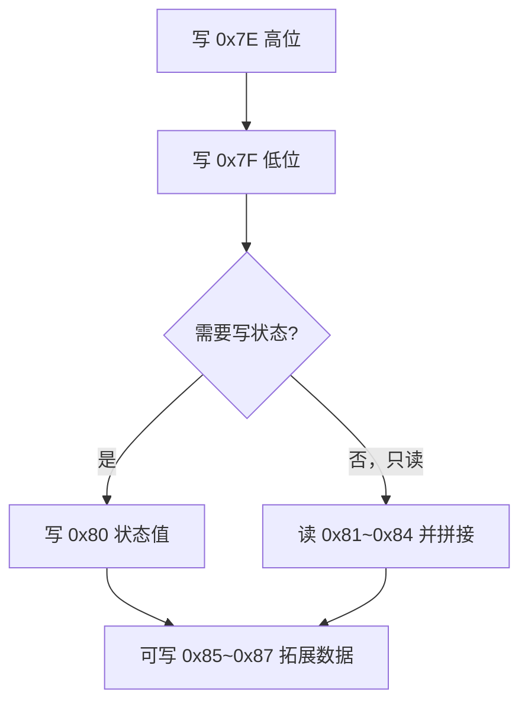

# CH368 寄存器与操作说明

## 概览
- CH368 地址空间采用 Little-Endian（低地址存放低字节）。
- 所有寄存器均通过 CH367 提供的 `CH367mReadIoByte` / `CH367mWriteIoByte` 以单字节方式访问。
- `ch368_interface` 已将外部总线地址/数据透传至内部 `sys_addr/sys_data`，本文档中的地址可直接用固件读写。

## 1. 全局控制与状态寄存器（0x00 ~ 0x3F）

| 地址 (HEX) | R/W | 信号名称 | 长度 | 功能描述与数值定义 |
| --- | --- | --- | --- | --- |
| 0x00 | R | magic_num | 1 Byte | 设备在线握手标识，恒为 `0x5A`。 |
| 0x01 | R | wp_head_L | 1 Byte | 工件头指针低 8 位，指示当前写入槽位。 |
| 0x0C | R | wp_head_H | 1 Byte | 工件头指针高 2 位，与 0x01 拼接为 10 位环形指针（0~1023）。 |
| 0x02 | R/W | motor_ctrl | 1 Byte | 电机启停/方向：Bit0=1 启动/0 停止；Bit1=1 正转/0 反转。 |
| 0x03 | R/W | motor_speed | 1 Byte | 电机速度设定，范围 0~255。 |
| 0x04 ~ 0x07 | R | global_enc | 4 Bytes | 全局绝对编码器值，0x04 为最低字节，0x07 为最高字节。 |
| 0x08 ~ 0x0B | R/W | target_reject | 4 Bytes | 气阀绝对触发位置，写入时遵循低字节优先。 |
| 0x0E | R/W | light_delay | 1 Byte | 相机打光延时，单位毫秒。 |
| 0x0F | R/W | blow_time | 1 Byte | 气阀吹气持续时间，单位毫秒。 |
| 0x20 ~ 0x3F | R/W | target_cam[0~7] | 32 Bytes | 8 个相机的绝对触发位置，每 4 字节对应一个相机（0x20~0x23 为相机1，以此类推至 0x3C~0x3F）。 |

## 2. 双翻页器与滑动观察窗（0x7E ~ 0x87）

| 地址 (HEX) | R/W | 信号名称 | 长度 | 功能描述与数值定义 |
| --- | --- | --- | --- | --- |
| 0x7E | W | wp_index_H | 1 Byte | 翻页寄存器高位，写入目标槽位的高 8 位。 |
| 0x7F | W | wp_index_L | 1 Byte | 翻页寄存器低位，写入目标槽位的低 8 位。 |
| 0x80 | R/W | wp_status | 1 Byte | 当前观察窗工件状态：`0x00` 无料/销毁，`0x01` 未知滑行，`0xAA` 良品，`0xEE` 次品。 |
| 0x81 ~ 0x84 | R | wp_abs_pos | 4 Bytes | 当前观察窗工件入场绝对快照（低字节在前），C# 需用全局编码器值相减得到相对距离。 |
| 0x85 ~ 0x87 | R/W | reserved | 3 Bytes | 数据拓展区，可写入视觉特征、颜色等参数。 |

## 3. 操作说明

### 3.1 电机控制
1. **启动电机**：写 `0x02 = 0x01`。
2. **停止电机**：写 `0x02 = 0x00`。
3. **调整速度**：写 `0x03 = 0~255`（数值越大速度越快）。

### 3.2 相机 / 气阀 32 位参数写入
- 总线为 8 位，写入 32 位值时必须按“低字节 → 高字节”的顺序写入连续地址。
- 示例：将相机 1 的位置设为 150000 (`0x000249F0`)：
  - `0x20 = 0xF0`（最低字节）
  - `0x21 = 0x49`
  - `0x22 = 0x02`
  - `0x23 = 0x00`（最高字节）

### 3.3 工件数据读写：翻页两步走
1. **定位目标槽位**  
   - 例如第 300 号槽位 (`0x012C`)：  
     - 写 `0x7E = 0x01`（高位 = `(300 >> 8) & 0xFF`）  
     - 写 `0x7F = 0x2C`（低位 = `300 & 0xFF`）
2. **操作观察窗 (0x80 ~ 0x87)**  
   - 判定良品：写 `0x80 = 0xAA`。  
   - 判定次品：写 `0x80 = 0xEE`。  
   - 抹除工件：写 `0x80 = 0x00`。  
   - 读取坐标：依序读 `0x81`~`0x84` 并按 Little-Endian 拼接成 32 位。

### 3.4 获取工件相对位置
- 公式：`相对距离 = 全局编码器值 (0x04~0x07) - 快照绝对值 (0x81~0x84)`。
- 采用 32 位有符号整数补码减法，天然免疫编码器溢出带来的跳变。

## 4. 注意事项
- 写入 32 位数据时务必保持地址连续且顺序正确，否则触发位置会错乱。
- 翻页寄存器必须先写入 0x7E/0x7F，再访问 0x80~0x87；否则会误操作前一个槽位。
- `CH367mReadIoByte/WriteIoByte` 每次仅处理 1 字节，进行多字节读写时需按顺序多次调用。
- `ch368_interface` 中只要 `RD` 为低电平就会触发读，写操作由 `WR` 上升沿锁存；上位机需保证信号时序干净。
- `0x85~0x87` 可按协议扩展视觉/工艺参数，使用前请与 FPGA 与上位机保持一致。